# Paneo

[](https://github.com/eigger/paneo/actions/workflows/ci.yml)
[](https://nodejs.org/)
[](https://github.com/eigger/paneo/releases/latest)
[](https://github.com/eigger/paneo/blob/master/LICENSE)
[](docs/install-device.md)
[](docs/design.md)
[](docs/install-device.md#83-home-assistant)
[](https://github.com/eigger/paneo/pkgs/container/paneo)

[English](README.md) · [한국어](README.ko.md)

Web-editable dashboards for Raspberry Pi and ambient displays.
Edit in the browser, hit **Apply**, and connected displays update live — no reload.

Widgets are **size-aware**: drag a corner to resize one, and it reflows its own layout on the fly —
no extra setting to flip. A calendar goes from a single day's agenda to a full month grid; a weather
card grows a forecast strip; a news feed reveals timestamps — all from the exact same widget, purely
by how much room you give it.

## Gallery

| View | Screenshot |
|------|------------|
| Editor | 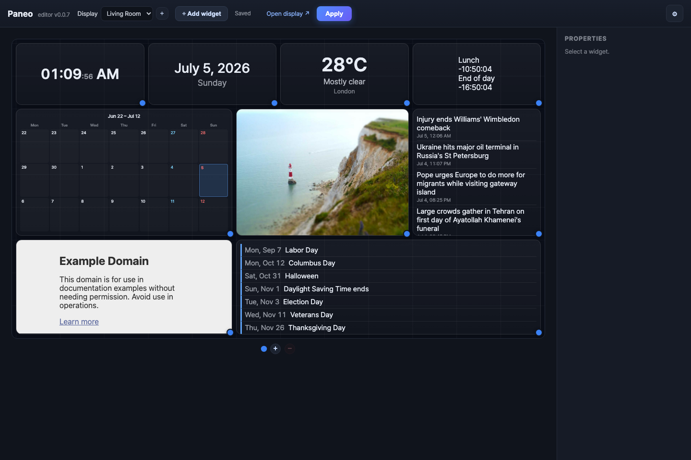 |
| Display | 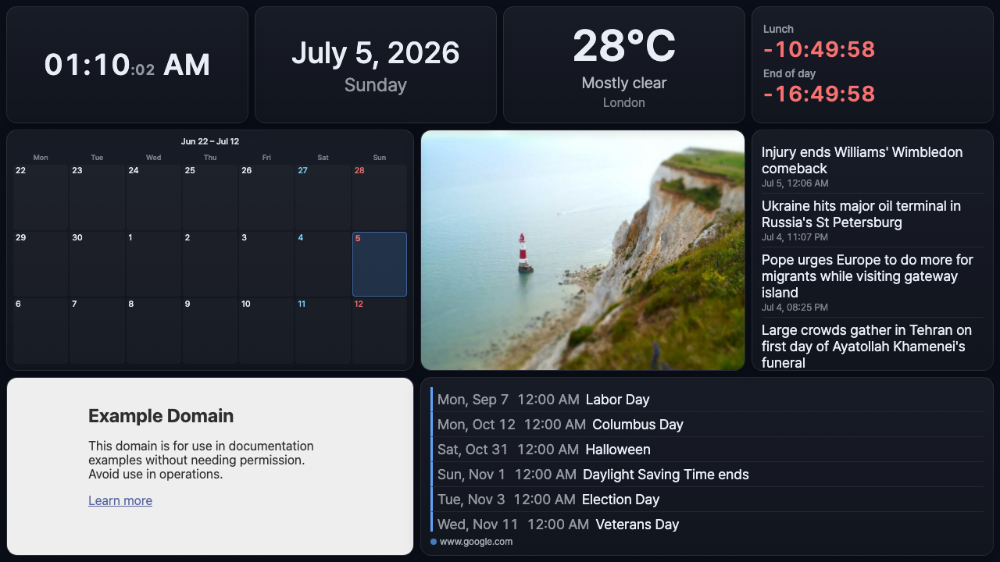 |

### Size-adaptive widgets

The same `paneo.calendar.month` widget, at four different grid sizes — nothing but its own
rendered box size decides which view it picks:

| Day (small) | Week | 3-week | Month (large) |
|:---:|:---:|:---:|:---:|
| 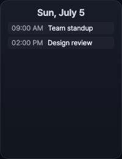 | 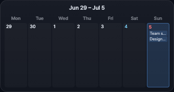 | 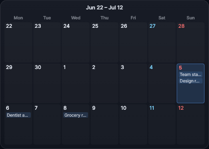 | 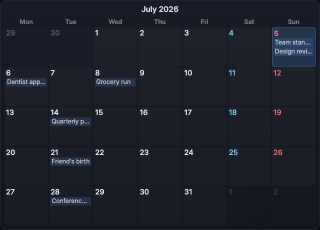 |

Weather does the same with a forecast strip, and Air quality / RSS / Event list reveal extra detail
(pollutant breakdown, publish dates, per-source color legend) once there's room for it:

| Weather — compact | Weather — with forecast |
|:---:|:---:|
| 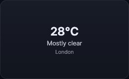 | 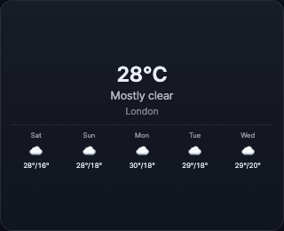 |

No config toggle switches these — a `ResizeObserver` on the widget's own box drives it, so it also
reacts live while you're dragging the resize handle in the editor.

### All widgets

| Widget | Preview |
|--------|---------|
| Clock | 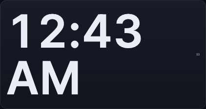 |
| Date | 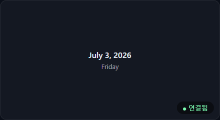 |
| Alarm timer | 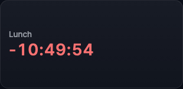 |
| Photo / video slideshow |  |
| External page | 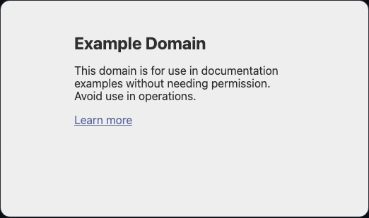 |
| Air quality (expanded) | 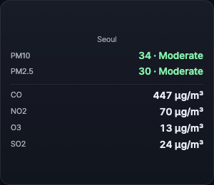 |
| RSS / News (expanded) | 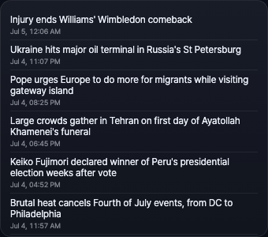 |
| Event list (expanded) | 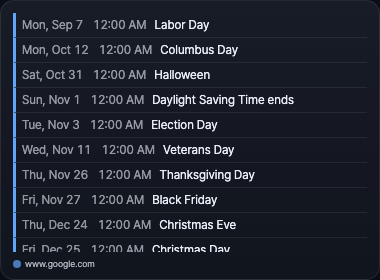 |

Also included, no dedicated screenshot: **Text**, **Home Assistant** entity (state/toggle + a
dedicated weather card), **World clock**, **D-Day countdown**, **To-do list**, **Exchange rate**,
**QR code** — 17 built-in widgets in total, plus third-party plugin widgets.

Regenerate all screenshots with `node scripts/capture-screenshots.mjs` (one-time setup:
`npm install --no-save playwright && npx playwright install chromium`; widgets only:
`PANEO_SCREENSHOT_MODE=widgets`).

> Design doc: [docs/design.md](docs/design.md) (decision log in §0) · Milestone: **M6 non-RTSP complete**, RTSP deferred

## What works today

- **Size-adaptive widgets**: calendar (day/week/3-week/month), weather (current vs. forecast), air
  quality (headline vs. full pollutant breakdown), RSS, and event list all switch their own internal
  view based on their rendered pixel size — see the gallery above.
- **Editor** (`/`): drag/resize a widget grid, per-widget settings (text/number/checkbox/dynamic URL
  lists), a categorized **Add widget** popover, per-device resolution (presets + custom + rotate),
  editor UI language (ko/en) and per-device display locale — all in a ⚙ settings panel separate from
  the editing toolbar.
- **Display** (`/d/<token>`): kiosk page, WebSocket-pushed layout updates, offline cache (last layout
  persists through a network drop), real CSS Grid layout so the same data renders proportionally
  correct at any resolution/aspect ratio.
- **Draft/Publish model**: editing never touches the live display until you hit **Apply** — publish
  broadcasts to every connected display for that device.
- **17 built-in widgets**: clock, date, text, weather, air quality, event list, adaptive calendar,
  RSS/news, sandboxed external page, photo/video slideshow, alarm timer, Home Assistant entity, world
  clock, D-Day countdown, to-do list, exchange rate, and QR code — plus a third-party plugin system.
- **Data proxy** (`src/dataproxy.js`): widgets never call third-party APIs directly — the server
  fetches, per-source-caches, and merges, so one broken calendar/feed doesn't take down the widget.
- **Device management**: per-device resolution/locale/performance profile, groups, live
  reload/identify, companion-agent power scheduling, and one-click remote updates from the editor.
- **Update-check**: the editor tells you whether a newer release exists before you trigger an update.
- **M6 third-party guardrails**: external pages render through a sandboxed iframe, and the editor
  surfaces widget version/required capabilities/permissions before publish. RTSP/camera streaming is
  intentionally deferred.
- **SQLite persistence** via Node's built-in `node:sqlite` — no native compile step.

## Run

```sh
npm install
npm start          # http://localhost:4321
```

Or with Docker (single portable container, `data/` persisted in a volume — see [docs/design.md](docs/design.md) §10). Every [GitHub Release](https://github.com/eigger/paneo/releases) publishes a prebuilt image to GHCR (`linux/amd64` + `linux/arm64`, so it runs on the Pi itself too):

```sh
docker compose pull && docker compose up -d   # released image
# or: docker compose up -d --build            # build from local source
```

- **Editor**: http://localhost:4321/ (a default device is seeded on first run)
- **Display**: click **Open display** in the editor, or open `http://localhost:4321/d/<token>`

Open the display in a second tab/window, arrange widgets in the editor, press **Apply**, and watch it update live.

### Production Deployment & HTTPS

Since the editor is password-protected, exposing it directly over HTTP is insecure. It is highly recommended to run Paneo behind a reverse proxy (e.g., Nginx, Traefik, or Cloudflare Tunnels) to enforce HTTPS:

1. **Proxy Setup**: Direct incoming port 443 (HTTPS) traffic from your reverse proxy to Paneo's local port 4321.
2. **Reverse Proxy SSL**: Set up Let's Encrypt or your own SSL certificates at the reverse proxy layer.
3. **Security**: Ensure client browsers connect securely so session cookies (`paneo_session`) cannot be intercepted over the network.


## Tests

```sh
npm test
```

CI runs the same test suite on Node.js 22 and 24 via GitHub Actions (`.github/workflows/ci.yml`).

## Install on a Raspberry Pi

**One command, one device** — server + kiosk display + companion agent, all in one step:

```sh
curl -fsSL https://raw.githubusercontent.com/eigger/paneo/master/install.sh | sudo env PANEO_MODE=all bash
```

Reboot when it's done (`sudo reboot`) and the display boots straight into the kiosk. That's it —
skip everything below unless you're splitting server and display across multiple Pis.

> **Note:** After install and reboot, allow **up to ~5 minutes** on first boot before the display
> (kiosk) is fully up — Docker image pull, font install, and Chromium startup can take a while on a Pi.

<details>
<summary><strong>Multi-device setup, manual install, and other options</strong> (click to expand)</summary>

Run **only the block for your role** — not every block.

**Server Pi** (server only, no kiosk):

```sh
curl -fsSL https://raw.githubusercontent.com/eigger/paneo/master/install.sh | sudo env PANEO_MODE=server bash
```

**Display Pi** (kiosk + agent; requires a running server and a device token from **Open display** in the editor):

```sh
curl -fsSL https://raw.githubusercontent.com/eigger/paneo/master/install.sh \
  | sudo env PANEO_MODE=display \
      PANEO_SERVER=http://<server-ip>:4321 \
      PANEO_TOKEN=<token> \
      bash
```

Other options (pinning a version, custom device name, Docker Compose/systemd-by-hand, companion
agent only, Chromium kiosk autostart internals): full guide in
[`docs/install-device.md`](docs/install-device.md) ([한국어](docs/install-device.ko.md)), which also
covers first dashboard setup, Home Assistant, photo frame, and troubleshooting.

</details>

## Updating

On the Pi itself, one command updates the server image and agent (and, in `all` mode, codecs and the
kiosk browser restart) while keeping all data intact:

```sh
curl -fsSL https://raw.githubusercontent.com/eigger/paneo/master/scripts/update-pi.sh | sudo bash
```

Or, once a display's companion agent is connected, trigger the same update from the editor's ⚙
**Settings** panel — it also shows whether a newer release is available first. Details (server-only
mode, manual Docker Compose update, agent-only update): [`docs/install-device.md`](docs/install-device.md#12-updates).

## Uninstallation

To completely remove Paneo, the companion agent, and the kiosk configuration from the device, run the following command:

```sh
curl -fsSL https://raw.githubusercontent.com/eigger/paneo/master/uninstall.sh | sudo bash
```

## Layout / stack

- `src/server.js` — Fastify + `@fastify/websocket` REST + WS hub
- `src/store.js` — SQLite (`node:sqlite`) persistence; auto-migrates the old M0 JSON file if present
- `src/dataproxy.js` — server-side weather/air-quality/iCal/RSS fetch + cache + multi-source merge
- `src/version.js` — component version manifest + GitHub-releases update-availability check
- `src/brand.js` — central name/`pluginPrefix` (rename the product from here)
- `public/shared/widgets.js` — widget registry shared by editor preview and display, including the
  size-adaptive (`ResizeObserver`-driven) widgets
- `public/shared/gridlayout.js` — shared CSS Grid sizing so editor preview and display stay proportionally in sync
- `public/editor/` — grid editor (drag/resize, settings modal, add-widget popover)
- `public/display/` — kiosk display page
- `agent/` — optional companion agent for display power control and remote updates
- `install.sh` — GitHub bootstrap installer for Raspberry Pi
- `scripts/install-pi.sh` — Raspberry Pi one-click installer for server/display/all-in-one modes
- `scripts/update-pi.sh` — Raspberry Pi one-click updater
- `scripts/capture-screenshots.mjs` — regenerates the README screenshots (Playwright)
- `test/` — Node.js built-in test runner suite

## Widgets

`paneo.clock` · `paneo.date` · `paneo.text` · `paneo.weather` · `paneo.airquality` · `paneo.calendar` ·
`paneo.calendar.month` · `paneo.rss` · `paneo.iframe` · `paneo.photo` · `paneo.timer` ·
`paneo.homeassistant` · `paneo.worldclock` · `paneo.dday` · `paneo.todo` · `paneo.exchangerate` ·
`paneo.qrcode`

## Repository

https://github.com/eigger/paneo
